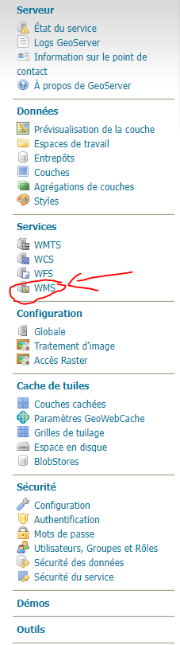
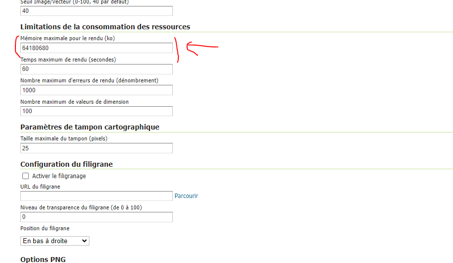

**1. Importer le plugin**
```
<extensions>
        <extension type="component" id="refreshLegend" path="demo/addons"/>
</extensions>
```
**2. Configurer le plugin**
 - Tout d'abords, il faut augmenter la mémoire maximale du rendu pour le service ``WMS`` au niveau de geoserver. Pour cela, il faut accéder à la page du service WMS (Voir figure ci-dessous)
 - Puis se rendre à la partie ``Limitations de la consommation des ressources`` pour changer la mémoire maximale pour le rendu. mettre la valeur que vous jugez utile (Voir figure ci-dessous) 